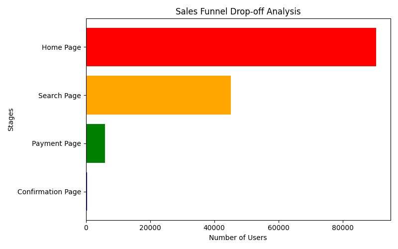

# Funnel Analysis — Executive Summary

  

Short, reproducible analysis for site conversion: this repo computes aggregated unique user counts across four funnel stages (Home → Search → Payment → Confirmation) to reveal where the majority of users drop off.

## Table of Contents
- [Executive Summary](#executive-summary)
- [Quick Snapshot](#quick-snapshot)
- [Example Output](#example-output)
- [Getting Started](#getting-started)
- [Run the Analysis / Notebook](#run-the-analysis--notebook)
- [Testing & CI](#testing--ci)
- [Data & Methodology](#data--methodology)
- [Limitations](#limitations)
- [File Structure](#file-structure)
- [Contributing & License](#contributing--license)
- [Next Steps](#next-steps)

## Executive Summary
This project aims to quantify and visualize user attrition in a website's funnel from Homepage through Payment Confirmation. The top-level objective is to identify critical stages where conversion can be improved.

Key insight: there is heavy attrition in the Payment stage; deeper investigation (UX, payment gateway) is recommended.

---

## Quick Overview
- Home Page: 90,400 users
- Search Page: 45,200 users (≈ 50% drop from Home)
- Payment Page: 6,030 users (≈ 86.7% drop from Search)
- Confirmation Page: 452 users (≈ 92.5% drop from Payment)

These values are computed from CSVs located in the `data/` folder and are reproducible using the instructions below.

---

## Example Output
The analysis prints a funnel summary and missing-values report, and saves a horizontal-funnel chart to `sales_funnel_chart.png`: 

```text
Sales Funnel Summary:
                  Users  Drop-off Rate (%)
Home Page          90400                NaN
Search Page        45200          50.000000
Payment Page        6030          86.659292
Confirmation Page    452          92.504146

Missing values summary:
Home Page: 0 missing values
Search Page: 0 missing values
Payment Page: 0 missing values
Confirmation Page: 0 missing values
User Data: 0 missing values
Chart saved to: sales_funnel_chart.png
```

Chart example (generated file):



---

## Getting Started
Prerequisites: Python 3.10+ recommended and Git.

Clone the repo:
```bash
git clone https://github.com/krishnamurthi-ramesh/sales-funnel-analysis-main.git
cd sales-funnel-analysis-main
```

Create a virtual environment and install dependencies:

Windows (PowerShell):
```powershell
python -m venv .venv
.\.venv\Scripts\Activate.ps1
pip install -r requirements.txt
```

macOS / Linux (bash):
```bash
python3 -m venv .venv
source .venv/bin/activate
pip install -r requirements.txt
```

---

## Run the Analysis / Notebook
To run the script (fast reproducible run):

```bash
python run_analysis.py
```

To use the notebook (`sales_funnel_analysis.ipynb`):
1. Launch Jupyter (`jupyter notebook` or `jupyter lab`) with the `.venv` kernel.
2. Verify the notebook cells' types (Markdown vs code) for readability.

### Quick Commands (1-liners)
- Clone + setup + install (PowerShell):
```powershell
git clone https://github.com/krishnamurthi-ramesh/sales-funnel-analysis-main.git ; cd sales-funnel-analysis-main ; python -m venv .venv ; .\.venv\Scripts\Activate.ps1 ; pip install -r requirements.txt
```
- Clone + setup + install (Bash):
```bash
git clone https://github.com/krishnamurthi-ramesh/sales-funnel-analysis-main.git && cd sales-funnel-analysis-main && python3 -m venv .venv && source .venv/bin/activate && pip install -r requirements.txt
```

---

## Testing & CI
Run the project's smoke test:

```bash
pytest -q
```

We added a simple GitHub Actions workflow (`.github/workflows/ci.yml`) that runs on push and pull requests to the `main` branch and enables automated testing. 

### Troubleshooting
- If you see `ModuleNotFoundError` for `matplotlib.backends.registry` when running the script from a different python environment, make sure:
  - You activate the repository virtual environment (`.venv`) before running the script. Use the `python` executable from the venv if you need to run tests with the venv's python directly: `path/to/.venv/Scripts/python -m pytest -q`.
  - You have installed pinned dependencies: `pip install -r requirements.txt`.
- If the script fails in a headless environment (no GUI), set the matplotlib backend to a non-GUI option: `import matplotlib; matplotlib.use('Agg')` (or set env variable `MPLBACKEND=Agg`).


---

## Data & Methodology
- Input: several CSV tables (per-page events and user metadata) in `data/`.
- Method: aggregate unique `user_id` across pages to compute stage counts. Compute percentage drop-off between consecutive stages.
- Output: a CSV-free chart and printed summary. `run_analysis.py` replicates the logic outside the notebook for easy automation and testing.

This is intentionally a high-level approach—ideal as a first pass for prioritizing which funnel stages deserve deeper troubleshooting.

---

## Limitations
- We use unique user counts per page only; sessions and sequence transitions are not modeled.
- No time-windowing is applied — users may appear in later stages on different days.
- The analysis assumes events in CSVs are correct; no data quality validation beyond basic missing-value checks is performed.

If you plan to use this for production analytics or join with other clickstream data, consider building incremental pipelines and sessionization.

---

## File Structure
- `data/` — CSV files (home, search, payment, confirmation, user)
- `sales_funnel_analysis.ipynb` — Notebook with inline commentary and visuals
- `run_analysis.py` — Script that mirrors the notebook and saves the chart
- `tests/test_run_analysis.py` — Smoke test
- `requirements.txt` — Pinned runtime dependencies
- `.github/workflows/ci.yml` — CI workflow for running tests

---

## Contributing & License
This project is open-source under the MIT License (see `LICENSE`). Please read `CONTRIBUTING.md` and `CODE_OF_CONDUCT.md` before contributing. Contributions are welcome—PRs are reviewed on the `main` branch.

---

## Next Steps (Suggested)
- Add a small core module (`analysis.py`) with testable functions and expand unit tests around edge cases (duplicate user_ids, missing columns, etc.)
- Add segmentation analysis by `device` and `sex` using `user_table` as a first next step.
- Enhance notebook with exploratory analyses and a brief executive summary chart.
- Add a GitHub ‘issue template’ and PR template for higher quality contributions.

---

## Support & Acknowledgments
For questions, feature requests, or help contributing, open an issue in this repository or contact the author via email.


---

## Contact
Author: Krishnamurthi — kiccha@gmail.com

If you’d like, I can now:
- Convert notebook header/comment cells into Markdown cells, or
- Extract `run_analysis.py` logic into `analysis.py` and add unit tests for each function.
# 📊 Sales Funnel Analysis — Executive Summary

## Executive Summary
This project analyzes a website's sales funnel to measure how many users drop off at each stage from the Home Page through to Payment Confirmation. The analysis uses the provided CSV tables describing user visits and produces an aggregated funnel summary and a chart showing the magnitude of drop-off at each stage.

- Goal: Quantify the distribution of users across funnel stages and identify critical drop-off points.
- Key Insight: The most significant drop occurs at the Payment stage; investigating UX/checkout flow is recommended.

---

## Quick Project Snapshot
- Home Page: 90,400 users
- Search Page: 45,200 users (≈ 50% drop from Home)
- Payment Page: 6,030 users (≈ 86.7% drop from Search)
- Confirmation Page: 452 users (≈ 92.5% drop from Payment)

These values are computed from the CSVs found in `data/` and are reproducible by following the instructions below.

---

## What’s Included
- `data/`: CSV tables that represent user events per page
- `sales_funnel_analysis.ipynb`: Notebook with narrative analysis and visualizations
- `run_analysis.py`: Script to run the core analysis and generate `sales_funnel_chart.png`
- `tests/test_run_analysis.py`: Smoke test ensuring the analysis runs and writes the chart
- `requirements.txt`: Pinned dependencies for reproducible installs
- `check_project.ps1`: PowerShell check script for Windows users


---

## Open Source
This repository is open-source and licensed under the MIT license (see `LICENSE` file). You are welcome to submit issues, suggestions, and pull requests. We follow the standard fork-and-pull request model.

Badges:
- CI: 
- License: 

See `CONTRIBUTING.md` and `CODE_OF_CONDUCT.md` for details on how to contribute and community expectations.

---

## Setup & Reproducibility (Recommended)
Use a virtual environment to avoid system-wide package changes.

On Windows (PowerShell):
```powershell
cd e:\sales-funnel-analysis-main\sales-funnel-analysis-main
python -m venv .venv
.\.venv\Scripts\Activate.ps1
pip install -r requirements.txt
```

On macOS / Linux (bash):
```bash
cd /path/to/sales-funnel-analysis-main
python3 -m venv .venv
source .venv/bin/activate
pip install -r requirements.txt
```

---

## Run the Analysis
Run the packaged script to reproduce the results quickly (and generate a chart):

```powershell
python run_analysis.py
```

This will:
- Read CSV files from `data/`
- Print a funnel summary table and a missing-values summary
- Save the funnel chart to `sales_funnel_chart.png` in the project root

For notebook users, open `sales_funnel_analysis.ipynb` and select the virtual environment kernel (`sales-funnel-venv`) if you installed a kernel. If you prefer the same behavior as the script, run the entire notebook after making the cell types correct (Markdown vs Code) when editing.

---

## Testing
Run the project's smoke test with pytest to verify the script runs and writes the chart:

```powershell
pytest -q
```

Use the included `check_project.ps1` to run a quick project check (Windows PowerShell):

```powershell
.\check_project.ps1
```

---

## Data & Methodology
We aggregate the number of distinct users at each funnel stage. The data model is simple:
- CSV files: `home_page_table`, `search_page_table`, `payment_page_table`, `payment_confirmation_table`, and `user_table`.
- Users are joined (deduplicated by `user_id`) to compute unique counts per stage.
- Results are expressed in counts and percent drop off between successive stages.

This approach provides a clear, high-level view of attrition without delving into session-level or time-based modeling. It’s a useful first step to highlight where deeper investigation should be prioritized.

---

## Next Steps / Recommendations
- Investigate behavioral reasons for drop-offs in the Payment stage:
  - UX issues, payment gateway errors, shipping/fees surprises, or device-specific behavior.
- Segment by device, date, or other user attributes (columns exist in `user_table`) to localize problems.
- Add session-level analysis and time-between-stage metrics for a more robust funnel model.
- Add unit tests that validate functions in an importable module (e.g., `analysis.py`) so logic is testable beyond a smoke test.
- Add CI (GitHub Actions) to run `pytest` automatically on PRs.

---

## Contributors & Contact
Author: Krishnamurthi
Email: kiccha@gmail.com

If you’d like, I can also:
- Convert notebook header/comment cells into proper Markdown cells so they render correctly in Jupyter while preserving execution order, or
- Add a small module `analysis.py` for unit-testable functions and expand tests to cover logic.

---

## License
This project does not include a license file yet. Please add a LICENSE file if you plan to open-source this project.

---

Thanks for using the Sales Funnel Analysis repository — if you want the README tailored further (e.g., more visuals, live GIF, or a results table), tell me what you’d like to highlight.
# 📊 Sales Funnel Analysis

## 📌 Overview
This project analyzes user drop-offs at each stage of a sales funnel, providing insights into potential areas of improvement.

## 🗂 Dataset
The dataset consists of user interactions at different stages of the funnel:
1. **Home Page** → Entry point for users.
2. **Search Page** → Users search for products/services.
3. **Payment Page** → Users initiate the purchase process.
4. **Confirmation Page** → Successful transaction confirmation.

## 📉 Key Findings
- **50% drop-off** from **Home Page** to **Search Page**.
- **86.66% drop-off** from **Search Page** to **Payment Page**.
- **92.50% drop-off** from **Payment Page** to **Confirmation Page**.

These insights indicate a significant drop-off at the payment stage, suggesting potential issues with user experience or trust.

## 📊 Visualization
Below is a visualization of the user drop-off across different stages:


## 🛠️ How to Run the Analysis
### 1️⃣ Clone the Repository
Run the following command in your terminal to clone this repository:
```bash
git clone https://github.com/krishnamurthi-ramesh/sales-funnel-analysis-main.git
cd sales-funnel-analysis-main
```

### 2️⃣ Setup Python environment
It's recommended to use a virtual environment to install dependencies.

On Windows (PowerShell):
```powershell
python -m venv .venv
.\.venv\Scripts\Activate.ps1
pip install -r requirements.txt
```

On macOS/Linux (Bash):
```bash
python3 -m venv .venv
source .venv/bin/activate
pip install -r requirements.txt
```

### 3️⃣ Run the analysis script
You can run the analysis script (which replicates the notebook) with:
```powershell
python run_analysis.py
```

This will output a summary of the funnel and save `sales_funnel_chart.png` in the project root.

### 4️⃣ Run the Notebook (Optional)
If you prefer to use the Jupyter Notebook:

1. Start Jupyter Notebook or Jupyter Lab via:
```bash
jupyter notebook
```
2. Ensure the kernel is configured to use the project's virtual environment. If needed, install the kernel:
```bash
python -m ipykernel install --user --name=sales-funnel-venv --display-name "sales-funnel-venv"
```
Select the `sales-funnel-venv` kernel when running the notebook.

### ✅ Run tests
To run the project's smoke test (ensures the analysis script runs and produces the chart), run:
```powershell
pytest -q
```


## 🚀 Future Improvements
- Investigate reasons for high drop-off rates.
- Recommend UX changes to improve conversion.
- Conduct A/B testing to measure the impact of design changes.

---
*Author: Krishnamurthi*  

*Email: kiccha@gmail.com*  
